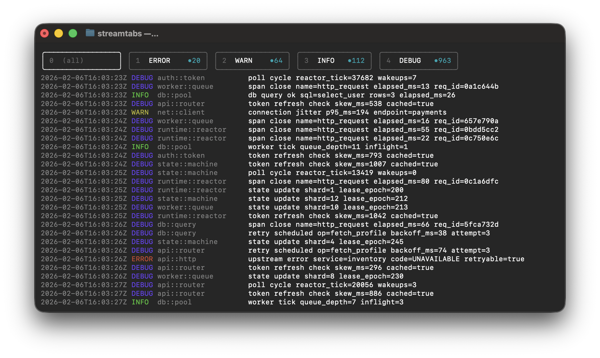

# streamtabs

`streamtabs` is a terminal UI filter viewer for piped input.

It always includes tab `0` as `(all)`.  
Then each filter argument becomes tabs `1..N`, each showing lines containing that filter substring.

## Features

- Built-in `0` tab for raw `(all)` input.
- One additional tab per filter argument.
- Tabs include a subtle fixed-width unread slot (dim gray), so counts do not shift tab positions as they grow.
- If the tab row is too wide for the terminal, tab labels are truncated with `...`.
- `TAB` cycles tabs.
- Direct tab jump with number keys: `0` selects `(all)`, `1`-`9` select tabs 1-9.
- Tab row shows tab number prefixes in gray.
- Each tab is rendered as its own rounded box-drawing "pill" (`╭╮╰╯`).
- Tab labels use roomy spacing between tabs for readability.
- Left-click a tab to select it.
- Global pause/unpause with `Space`.
- Paused state is shown to the right of the rightmost tab.
- While paused, each tab is frozen to a snapshot taken at pause time (switching tabs will not show newly arriving lines).
- While paused, unread counts continue for post-snapshot matches; viewing a tab while paused only marks snapshot-visible matches as read.
- Left-clicking a line selects it, injects it into every tab in chronological position, and highlights it.
- While paused with a selected line, each tab scrolls so the selected line is centered.
- Unpausing jumps back to the live tail instantly.
- `q`/`Ctrl+C` quits and signals upstream pipeline producers (for example `tail -f`) to stop.
- Bounded per-tab buffering (`5000` lines per tab) to avoid unbounded memory growth.

## Build

```bash
cargo build --release
```

Binary:

```bash
./target/release/streamtabs
```

## Usage

```bash
<producer> | ./target/release/streamtabs <filter1> <filter2> ...
```

Examples:

```bash
cat ./file.txt | ./target/release/streamtabs foo bar
```

```bash
tail -f app.log | ./target/release/streamtabs error warn info
```

```bash
log stream --style compact | ./target/release/streamtabs Error Fault WindowServer
```

## Keys

- `TAB`: next tab
- `0`: jump to `(all)` tab
- `1`-`9`: jump to tabs 1-9
- `Space`: pause/unpause
- `d`: clear selected line
- `q`, `Ctrl+C`: quit
- Mouse left-click tab: select tab
- Mouse left-click line: select/highlight line across tabs (click selected line again to deselect)

## Screenshots

Live stream:



Filtered tab selected (`3` = `INFO`):


Selected line on `INFO` tab:


Selected line after switching to `(all)` tab, then pausing:


Regenerate screenshots (captures ANSI color with `RUST_LOG_COLOR=always`):

```bash
./scripts/generate-readme-screenshots.sh
```

This script captures real Terminal pixels on macOS (`screencapture`) so font/border rendering matches what you see on screen.  
You may need to grant Screen Recording + Automation permissions for Terminal and your shell.
