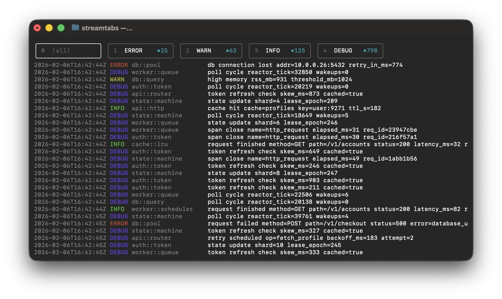
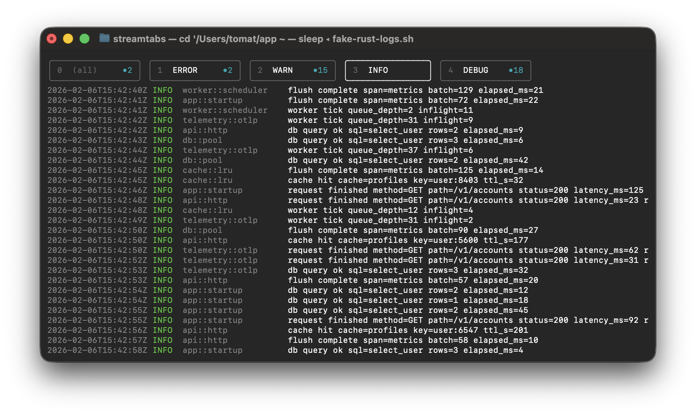
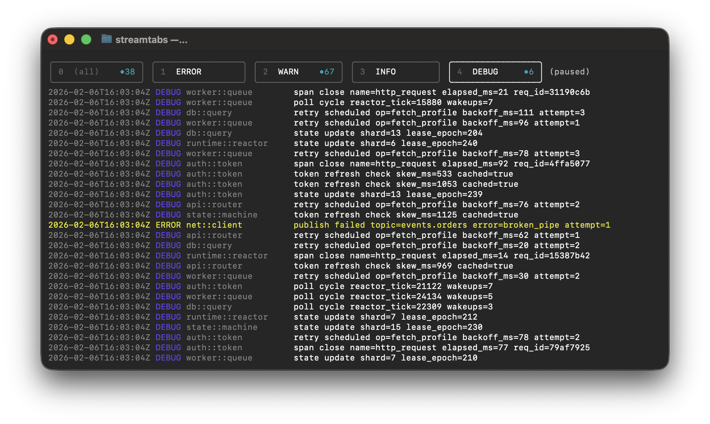

# streamtabs

This makes it easy to follow noisy logs without rerunning commands.

You pipe text in, pass filters as arguments, and get:

- tab `0`: `(all)` lines
- tabs `1..N`: one tab per filter

## Install

From crates.io:

```bash
cargo install streamtabs
```

This installs both binaries:

- `streamtabs`
- `st` (short alias)

## Quick Start

Run with at least one filter:

```bash
tail -f app.log | st error warn info
```

## More Examples

```bash
cat ./file.txt | st foo bar
```

```bash
log stream --style compact | st Error Fault WindowServer
```

## Controls

- `Tab`: next tab
- `0` to `9`: jump to tab number
- `Space`: pause/resume
- `q` or `Ctrl+C`: quit
- Mouse click tab: switch tabs
- Shift+mouse click tab: toggle that tab in the current OR view
- Mouse click line: highlight that line across tabs
- `d`: cancel highlighted line

## Notes

- Run in a terminal (`stdout` must be a TTY).
- `st` requires at least one filter argument.
- Each tab stores up to `5000` lines.

## Screenshots

Live stream:



Filtered tab selected (`3` = `INFO`):



Selected line on `ERROR` tab:


Selected `ERROR` line after switching to `DEBUG` tab, then pausing:


